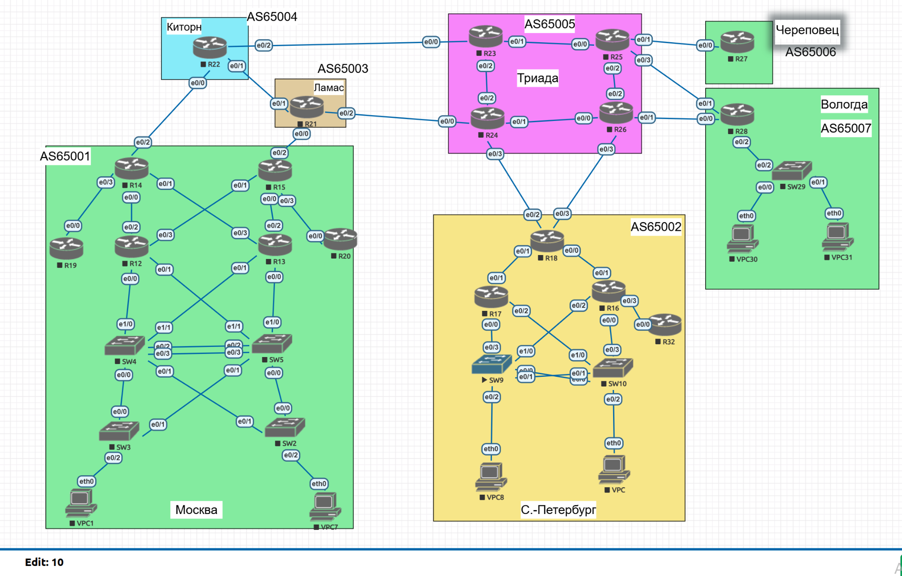

# ДЗ01: Проектирование сети

Учебная лаба 18 роутеров (Cisco IOL) и 7 свитчей (IOU L2) в 7 автономных системах. Документ содержит полный адресный план, краткое описание автоматизации и итоги по домашке.



---

## 1. Адресация

### Соглашения

| Назначение | Формула | Пример |
|---|---|---|
| Лупбэк роутера | `10.{site}.255.{id}/32` | R12 -> `10.1.255.12/32` |
| In-band mgmt | `10.{site}.250.{id}/24` | R12 -> `10.1.250.12/24` |
| OOB mgmt | `192.168.100.{id}/24` | R12 -> `192.168.100.12` |
| Intra-AS P2P | `10.{site}.254.x/31` | `10.1.254.0/31`, `10.1.254.2/31`, ... |
| Inter-AS P2P | `172.16.0.x/31` | `172.16.0.0/31`, `172.16.0.2/31`, ... |

`site` - индекс AS (Moscow=1, SPB=2, Lamas=3, Kitorn=4, Triada=5, Cherepovets=6, Vologda=7).
`id` - числовой суффикс имени (R12 -> 12, SW9 -> 9, SW10 -> 10).

### Сайты и AS

| Site | ASN | Supernet | Routers | Switches |
|---|---|---|---|---|
| Moscow | 65001 | 10.1.0.0/16 | R12, R13, R14, R15, R19, R20 | SW2, SW3, SW4, SW5 |
| SPB | 65002 | 10.2.0.0/16 | R16, R17, R18, R32 | SW9, SW10 |
| Lamas | 65003 | 10.3.0.0/16 | R21 | - |
| Kitorn | 65004 | 10.4.0.0/16 | R22 | - |
| Triada | 65005 | 10.5.0.0/16 | R23, R24, R25, R26 | - |
| Cherepovets | 65006 | 10.6.0.0/16 | R27 | - |
| Vologda | 65007 | 10.7.0.0/16 | R28 | SW29 |

### Устройства

| Hostname | Site | Loopback | Mgmt OOB | In-band Mgmt |
|---|---|---|---|---|
| R12 | Moscow | 10.1.255.12 | 192.168.100.12 | 10.1.250.12 |
| R13 | Moscow | 10.1.255.13 | 192.168.100.13 | 10.1.250.13 |
| R14 | Moscow | 10.1.255.14 | 192.168.100.14 | 10.1.250.14 |
| R15 | Moscow | 10.1.255.15 | 192.168.100.15 | 10.1.250.15 |
| R19 | Moscow | 10.1.255.19 | 192.168.100.19 | 10.1.250.19 |
| R20 | Moscow | 10.1.255.20 | 192.168.100.20 | 10.1.250.20 |
| R16 | SPB | 10.2.255.16 | 192.168.100.16 | 10.2.250.16 |
| R17 | SPB | 10.2.255.17 | 192.168.100.17 | 10.2.250.17 |
| R18 | SPB | 10.2.255.18 | 192.168.100.18 | 10.2.250.18 |
| R32 | SPB | 10.2.255.32 | 192.168.100.32 | 10.2.250.32 |
| R21 | Lamas | 10.3.255.21 | 192.168.100.21 | 10.3.250.21 |
| R22 | Kitorn | 10.4.255.22 | 192.168.100.22 | 10.4.250.22 |
| R23 | Triada | 10.5.255.23 | 192.168.100.23 | 10.5.250.23 |
| R24 | Triada | 10.5.255.24 | 192.168.100.24 | 10.5.250.24 |
| R25 | Triada | 10.5.255.25 | 192.168.100.25 | 10.5.250.25 |
| R26 | Triada | 10.5.255.26 | 192.168.100.26 | 10.5.250.26 |
| R27 | Cherepovets | 10.6.255.27 | 192.168.100.27 | 10.6.250.27 |
| R28 | Vologda | 10.7.255.28 | 192.168.100.28 | 10.7.250.28 |
| SW2 | Moscow | - | 192.168.100.2 | 10.1.250.102 |
| SW3 | Moscow | - | 192.168.100.3 | 10.1.250.103 |
| SW4 | Moscow | - | 192.168.100.4 | 10.1.250.104 |
| SW5 | Moscow | - | 192.168.100.5 | 10.1.250.105 |
| SW9 | SPB | - | 192.168.100.9 | 10.2.250.109 |
| SW10 | SPB | - | 192.168.100.10 | 10.2.250.110 |
| SW29 | Vologda | - | 192.168.100.29 | 10.7.250.129 |

Mgmt OOB на роутерах - routed port `Ethernet1/3` с прямым IP.
Mgmt на свитчах - SVI `Vlan500` (порт `Ethernet1/3` в access VLAN 500). VLAN 1 не используется принципиально: на trunk-портах он native и идёт untagged.

### VLAN'ы на свитчах

| ID | Имя | Подсеть | Назначение |
|---|---|---|---|
| 10 | USERS | `10.{site}.10.0/24` | Пользовательские VPC (access-порты) |
| 20 | SERVERS | `10.{site}.20.0/24` | Серверные (VLAN создан, access-портов пока нет) |
| 250 | MGMT-INBAND | `10.{site}.250.0/24` | In-band SVI на свитчах (local, без gateway наружу) |
| 500 | MGMT-OOB | `192.168.100.0/24` | OOB через access-порт `Ethernet1/3` в Cloud1 |

VLAN 1 не используется (native на trunk'ах = риск). 10/20/250 - per-site (одинаковый ID, разные подсети у разных сайтов). VLAN 500 - глобально плоский для всей лабы.

Trunk-линки между свитчами пропускают `allowed vlan 10,20,250`. VLAN 500 на trunk'ах не ходит - mgmt-OOB изолирован напрямую через Cloud1, не через trunk-инфраструктуру.

**Port-channel (LACP):** параллельные линки между свитчами объединены в Po1 (`channel-group 1 mode active`):
- SW4 ↔ SW5: `Ethernet0/2` + `Ethernet0/3`
- SW9 ↔ SW10: `Ethernet0/0` + `Ethernet0/1`

**STP:** `spanning-tree mode rapid-pvst` на всех 7 свитчах. На access-портах к VPC: `spanning-tree portfast` (быстрый up) + `spanning-tree bpduguard enable` (auto-shutdown если на access-порт прилетит BPDU).

### Intra-AS линки

**Moscow (AS65001)**

| Линк | Сторона A | Сторона B | Сеть | A IP | B IP |
|---|---|---|---|---|---|
| R12 - R14 | R12 Eth0/2 | R14 Eth0/0 | 10.1.254.0/31 | 10.1.254.0 | 10.1.254.1 |
| R12 - R15 | R12 Eth0/3 | R15 Eth0/1 | 10.1.254.2/31 | 10.1.254.2 | 10.1.254.3 |
| R13 - R14 | R13 Eth0/3 | R14 Eth0/1 | 10.1.254.4/31 | 10.1.254.4 | 10.1.254.5 |
| R13 - R15 | R13 Eth0/2 | R15 Eth0/0 | 10.1.254.6/31 | 10.1.254.6 | 10.1.254.7 |
| R14 - R19 | R14 Eth0/3 | R19 Eth0/0 | 10.1.254.8/31 | 10.1.254.8 | 10.1.254.9 |
| R15 - R20 | R15 Eth0/3 | R20 Eth0/0 | 10.1.254.10/31 | 10.1.254.10 | 10.1.254.11 |

**SPB (AS65002)**

| Линк | Сторона A | Сторона B | Сеть | A IP | B IP |
|---|---|---|---|---|---|
| R16 - R18 | R16 Eth0/1 | R18 Eth0/0 | 10.2.254.0/31 | 10.2.254.0 | 10.2.254.1 |
| R17 - R18 | R17 Eth0/1 | R18 Eth0/1 | 10.2.254.2/31 | 10.2.254.2 | 10.2.254.3 |
| R16 - R32 | R16 Eth0/3 | R32 Eth0/0 | 10.2.254.4/31 | 10.2.254.4 | 10.2.254.5 |

**Triada (AS65005)**

| Линк | Сторона A | Сторона B | Сеть | A IP | B IP |
|---|---|---|---|---|---|
| R23 - R24 | R23 Eth0/2 | R24 Eth0/2 | 10.5.254.0/31 | 10.5.254.0 | 10.5.254.1 |
| R23 - R25 | R23 Eth0/1 | R25 Eth0/0 | 10.5.254.2/31 | 10.5.254.2 | 10.5.254.3 |
| R24 - R26 | R24 Eth0/1 | R26 Eth0/0 | 10.5.254.4/31 | 10.5.254.4 | 10.5.254.5 |
| R25 - R26 | R25 Eth0/2 | R26 Eth0/2 | 10.5.254.6/31 | 10.5.254.6 | 10.5.254.7 |

Lamas, Kitorn, Cherepovets - по одному роутеру, intra-AS нет. Vologda - один роутер + L2 через SW29.

### Inter-AS линки

10 линков из пула `172.16.0.0/27`, по `/31` на линк.

| Линк | Сторона A | Сторона B | Сеть | A IP | B IP | Стык |
|---|---|---|---|---|---|---|
| R14 - R22 | R14 Eth0/2 | R22 Eth0/0 | 172.16.0.0/31 | 172.16.0.0 | 172.16.0.1 | Moscow / Kitorn |
| R15 - R21 | R15 Eth0/2 | R21 Eth0/0 | 172.16.0.2/31 | 172.16.0.2 | 172.16.0.3 | Moscow / Lamas |
| R21 - R22 | R21 Eth0/1 | R22 Eth0/1 | 172.16.0.4/31 | 172.16.0.4 | 172.16.0.5 | Lamas / Kitorn |
| R22 - R23 | R22 Eth0/2 | R23 Eth0/0 | 172.16.0.6/31 | 172.16.0.6 | 172.16.0.7 | Kitorn / Triada |
| R21 - R24 | R21 Eth0/2 | R24 Eth0/0 | 172.16.0.8/31 | 172.16.0.8 | 172.16.0.9 | Lamas / Triada |
| R25 - R27 | R25 Eth0/1 | R27 Eth0/0 | 172.16.0.10/31 | 172.16.0.10 | 172.16.0.11 | Triada / Cherepovets |
| R26 - R28 | R26 Eth0/1 | R28 Eth0/0 | 172.16.0.12/31 | 172.16.0.12 | 172.16.0.13 | Triada / Vologda (осн.) |
| R25 - R28 | R25 Eth0/3 | R28 Eth0/1 | 172.16.0.14/31 | 172.16.0.14 | 172.16.0.15 | Triada / Vologda (резерв) |
| R18 - R24 | R18 Eth0/2 | R24 Eth0/3 | 172.16.0.16/31 | 172.16.0.16 | 172.16.0.17 | SPB / Triada (осн.) |
| R18 - R26 | R18 Eth0/3 | R26 Eth0/3 | 172.16.0.18/31 | 172.16.0.18 | 172.16.0.19 | SPB / Triada (резерв) |

Резервные пути: Triada-Vologda (двойной линк), SPB-Triada (двойной линк), Moscow-Triada через Kitorn ИЛИ Lamas (две независимые тропы).

### Сводка по роутерам - какие интерфейсы куда

| Роутер | Eth0/0 | Eth0/1 | Eth0/2 | Eth0/3 | Eth1/3 |
|---|---|---|---|---|---|
| R12 | SW4 (L2) | SW5 (L2) | R14 (intra) | R15 (intra) | mgmt OOB |
| R13 | SW5 (L2) | SW4 (L2) | R15 (intra) | R14 (intra) | mgmt OOB |
| R14 | R12 (intra) | R13 (intra) | R22 (**inter**) | R19 (intra) | mgmt OOB |
| R15 | R13 (intra) | R12 (intra) | R21 (**inter**) | R20 (intra) | mgmt OOB |
| R19 | R14 (intra) | - | - | - | mgmt OOB |
| R20 | R15 (intra) | - | - | - | mgmt OOB |
| R16 | SW10 (L2) | R18 (intra) | SW9 (L2) | R32 (intra) | mgmt OOB |
| R17 | SW9 (L2) | R18 (intra) | SW10 (L2) | - | mgmt OOB |
| R18 | R16 (intra) | R17 (intra) | R24 (**inter**) | R26 (**inter**) | mgmt OOB |
| R32 | R16 (intra) | - | - | - | mgmt OOB |
| R21 | R15 (**inter**) | R22 (**inter**) | R24 (**inter**) | - | mgmt OOB |
| R22 | R14 (**inter**) | R21 (**inter**) | R23 (**inter**) | - | mgmt OOB |
| R23 | R22 (**inter**) | R25 (intra) | R24 (intra) | - | mgmt OOB |
| R24 | R21 (**inter**) | R26 (intra) | R23 (intra) | R18 (**inter**) | mgmt OOB |
| R25 | R23 (intra) | R27 (**inter**) | R26 (intra) | R28 (**inter**) | mgmt OOB |
| R26 | R24 (intra) | R28 (**inter**) | R25 (intra) | R18 (**inter**) | mgmt OOB |
| R27 | R25 (**inter**) | - | - | - | mgmt OOB |
| R28 | R26 (**inter**) | R25 (**inter**) | SW29 (L2) | - | mgmt OOB |

Легенда: `intra` - intra-AS P2P; `inter` - inter-AS P2P; `L2` - линк к свитчу; `-` - не используется.

---

## 2. Управление через Ansible

Всё, что выше, описывается тремя плоскими таблицами:

- `devices.csv` - устройства (hostname, kind, site, asn, loopback, mgmt_inband)
- `links.csv` - L3 P2P-линки между роутерами (device_a, iface_a, device_b, iface_b, network)
- `switch_ports.csv` - L2-порты свитчей (device, iface, mode, vlan, allowed_vlans, channel_group, description)

Пайплайн:

```
devices.csv + links.csv + switch_ports.csv
       |
       |  python csv2yaml.py
       v
host_vars/*.yml + inventory.yml
       |
       +--> python render.py R##  ----> rendered/R##.cfg  (для первичной заливки через консоль)
       |
       +--> ansible-playbook apply.yml  ----> SSH + ios_config  ----> устройство
```

Меняем строку в CSV - перегенерируем host_vars - применяем через Ansible. Изменения видны через `git diff`, ничего не правится руками на устройстве. Один источник правды, одна точка применения, повторяемо.

---

## 3. Структура проекта

```
otus_labs/
├── devices.csv             # источник правды: устройства
├── links.csv               # источник правды: P2P-линки
│
├── csv2yaml.py             # CSV -> host_vars/*.yml + inventory.yml
├── render.py               # локальный рендер конфигов (Python+Jinja, без Ansible)
│
├── ansible.cfg
├── inventory.yml           # сгенерирован
├── group_vars/all.yml      # общие переменные (mgmt_iface, креды, ssh-args)
├── host_vars/              # per-device, сгенерированы (loopback, mgmt, p2p_interfaces)
│
├── templates/device.j2     # один Jinja-шаблон, ветвится по kind (router/switch)
├── playbooks/apply.yml     # пушит конфиг через cisco.ios.ios_config
│
├── README.md               # этот файл (адресация + Ansible-обвязка + итоги)
├── switch_ports.csv        # источник правды: L2-порты свитчей (access/trunk/LAG)
└── net.png                 # схема EVE-NG топологии
```

Руками редактируются только `devices.csv`, `links.csv` и `switch_ports.csv`. Всё остальное (`host_vars/`, `inventory.yml`, `rendered/`) - вычисляемые артефакты.

---

## 4. Итоги

Все пять пунктов задания выполнены:

| Требование задания | Реализация |
|---|---|
| Адресное пространство задокументировано | Этот README + `devices.csv` + `links.csv` (источники правды для автоматики), `net.png` (схема). |
| IP на каждом активном порту роутеров | Loopback0 + Mgmt OOB `Ethernet1/3` + P2P-интерфейсы (`Ethernet0/x` /31). 23 P2P-линка на 18 роутеров. |
| VPC в своей VLAN | Все 6 VPC в VLAN 10 USERS, access-порты с `spanning-tree portfast` + `bpduguard enable`. |
| VLAN/Loopback management | Роутеры: `Loopback0` + L3 mgmt `Ethernet1/3`. Свитчи: SVI `Vlan500` (OOB через Cloud1) + SVI `Vlan250` (in-band local). |
| Без broadcast-штормов | `spanning-tree mode rapid-pvst` на всех 7 свитчах. Access-порты с portfast (быстрый up) + bpduguard (auto-shutdown если BPDU прилетит снаружи). |
| Оптимизация использования линков | LACP Port-channel'ы для параллельных линков: SW4↔SW5 (Po1 из 2 линков), SW9↔SW10 (Po1 из 2 линков). Оба линка in-use (`(P)` bundled), не блокируются STP. |

### Что подтверждает работоспособность

- **Все 25 устройств доступны по SSH** через Ansible: `ansible all -m ios_command -a "commands='show clock'"` отвечает от каждого.
- **LAG bundled на 4 свитчах:** `show etherchannel summary` показывает `Po1(SU)` с членами `(P)`.
- **L2-связность через trunk + LAG проверена:** ping между VPC8 (на SW9) и VPC (на SW10) идёт - пакет проходит SW9 access vlan10 → Po1 trunk → LAG → SW10 → access vlan10.
- **STP стабилизирован:** `show spanning-tree summary` подтверждает `rapid-pvst mode` на всех свитчах, без err-disabled инцидентов.

### Масштаб автоматизации

- **25 устройств** под управлением одного плейбука (`apply.yml`)
- **23 P2P-линка** + **4 LAG'а** + **4 VLAN'а** описаны в 3 плоских CSV
- **0 ручных правок** на устройствах после первичного bootstrap'а
- Любое изменение топологии или адресации: правим CSV > `python csv2yaml.py` > `ansible-playbook apply.yml` > готово.
